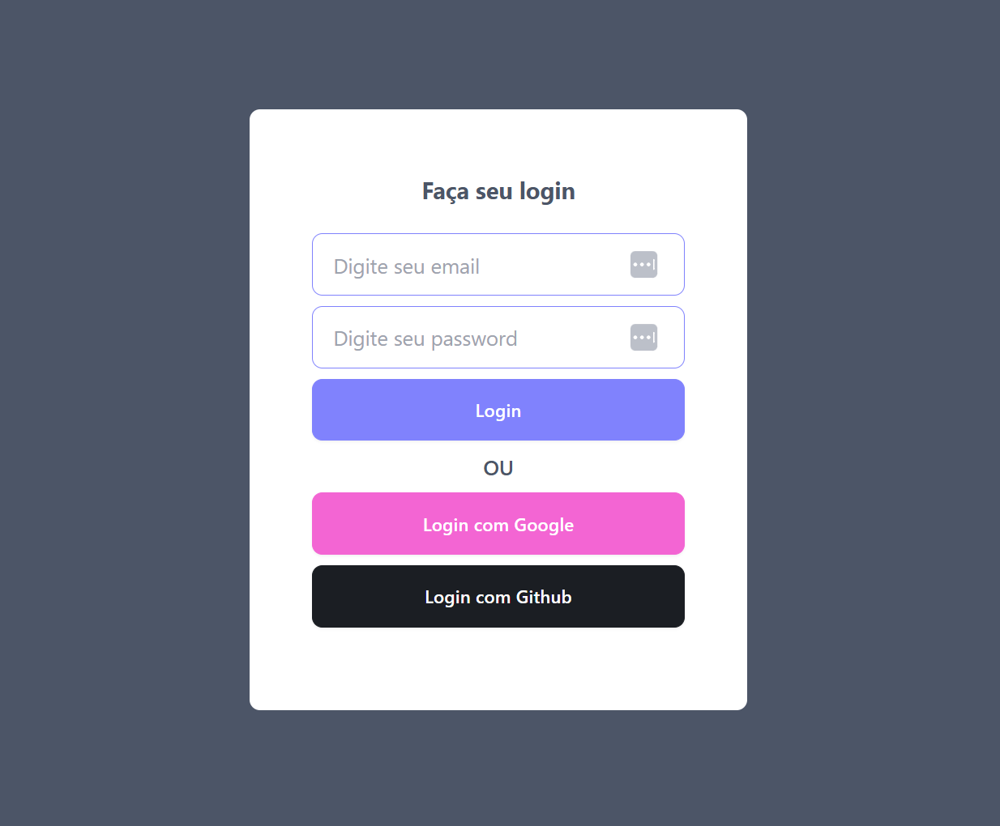

<p align="center">
  <a href="#-technologies">Technologies</a>&nbsp;&nbsp;&nbsp;|&nbsp;&nbsp;&nbsp;
  <a href="#-getting-started">Getting started</a>&nbsp;&nbsp;&nbsp;|&nbsp;&nbsp;&nbsp;
  <a href="#-project">Project</a>&nbsp;&nbsp;&nbsp;|&nbsp;&nbsp;&nbsp;
  <a href="#-layout">Layout</a>
</p>

<h1 align="center">
  <a href="#" target="_blank">
    LOGIN NEXTAUTH
  </a>
</h1>

---

## 🧪 Technologies

This project was developed using the following technologies:

- [Nextjs 15](https://nextjs.org/)
- [NextAuth](https://next-auth.js.org/)

## 🚀 Getting started

Clone the project and access the folder

```bash
$ git clone https://github.com/eltonsantos/login-nextauth.git && cd login-nextauth
```

Follow the steps below

```bash
# Install the dependencies
$ npm install

# Start the project
$ npm run dev
```

## 💻 Project

Login NextAuth and Social Login.

## 🔖 Layout

<p align="center">
  
</p>

## 👨🏻‍💻 Author

<h3 align="center">
  
  <br/>
  <strong>Elton Santos</strong> 🚀
  <br/>
  <br/>

 <a href="https://www.linkedin.com/in/eltonmelosantos" alt="LinkedIn" target="blank">
    
  </a>

  <a href="mailto:elton.melo.santos@gmail.com?subject=Olá%20Elton" alt="Email" target="blank">
    
  </a>

<br/>

Made with ❤️ by Elton Santos 👋🏽 [Contact me!](https://www.linkedin.com/in/eltonmelosantos/)

</h3>
